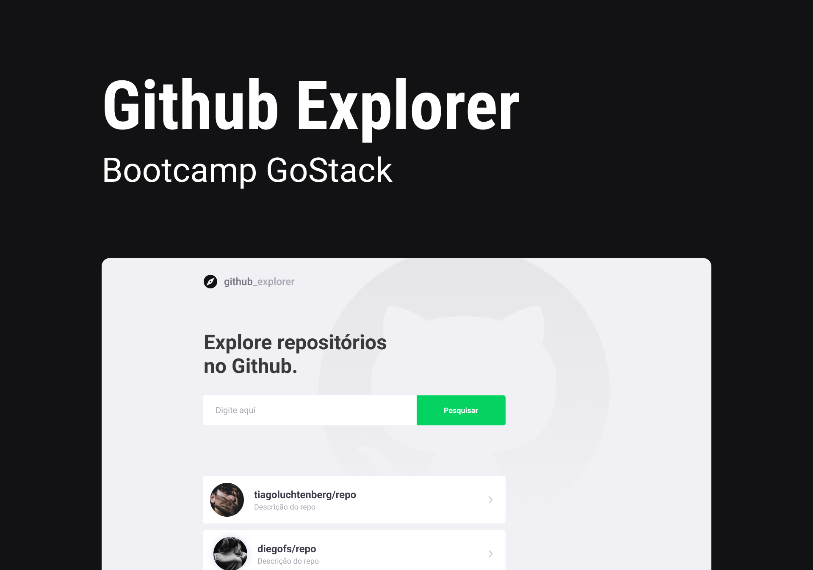

<h1 align="center">
  Bootcamp GoStack
</h1>

<p align="center">
  
</p>

<h2 align="center">Github Explorer</h2>

<p align="center">
  <a href="https://www.linkedin.com/in/pablonora/">
    
  </a>

  <a href="https://github.com/pablonora/nlw-01/commits/master">
    
  </a>

  <a href="https://github.com/pablonora/nlw-01/blob/master/LICENSE">
    
  </a>

  <a href="https://github.com/pablonora/github-explorer/stargazers">
    
  </a>
</p>

# Sobre este respositório

Este repositório contém uma aplicação proposta durante o Bootcamp GoStack da [RocketSeat](https://rocketseat.com.br/). Seu intuito é explorar o desenvolvimento de uma SPA que demonstra informações de repositórios no Github.

## O projeto

O projeto, chamado Github Explorer, foi desenvolvido baseado nas APIs expostas pelo Github. Nele, é possível inserir repositórios, que ficarão salvos no armazenamento local do navegador, de modo que seja possível visualizar informações básicas em uma lista, como criador, nome do repositório, imagem do dono e foto. Além disso, é possível ver mais detalhes clicando em um repositório na lista. Estes detalhes incluem quantas estrelas, forks e issues o repositório contem. Também é mostrada uma lista com as últimos issues e pull requests realizadas neste repositório.

## As Tecnologias utilizadas

Em relação ao layout, foi utilizado o [Figma](https://www.figma.com/file/1SxgOMojOB2zYT0Mdk28lB/) para sua concepção.

Entre as tecnologias utilizadas na codificação estão:

- [Node.js][nodejs]
- [TypeScript][typescript]
- [React][react-js]
- [Create React App][create-react-app]
- [Styled Components][styled-components]
- [Polished][polished]

## Como rodar no seu computador

Para ter o conteúdo disponível no seu computador, você vai precisar ter instalado o [Git](https://git-scm.com) - para clonar diretamente - ou baixar o conteúdo deste repositório via arquivo compactado (zip). Depois disso, será preciso instalar o [Node.js][nodejs].

A partir disso é necessário seguir os passos abaixo:

### Com o GIT Instalado

Abra um terminal e digite:

```bash
$ git clone https://github.com/pablonora/github-explorer
$ cd github-explorer
```

### Sem o GIT Instalado

Extraia o arquivo compactado baixado e navegue até a pasta dele através do terminal utilizando o comando `cd `.

## Preparação da aplicação

Para preparar o fornecimento das páginas web, com o terminal no diretório principal da aplicação, insira os seguintes comandos:

```bash
$ npm install
# Note que o comando anterior pode demorar um pouco dependendo da velocidade da sua conexão com à internet
$ npm start
```

## Utilizando

Para acessar a página web da aplicação, digite no seu navegador: http://localhost:3000. A partir daí, é só adicionar os repositórios que deseja visualizar, seguindo sempre o formato `<criador>/<nome>`, por exemplo: `pablolmnora/github-explorer`.

## Licença

Como este projeto foi nos dado com carinho pela [RocketSeat](https://rocketseat.com.br/), ele também está disponível neste repositório gratuitamente para todos através da licença MIT. Detalhes: [LICENSE](https://github.com/pablonora/github-explorer/blob/master/LICENSE).


[nodejs]: https://nodejs.org/
[typescript]: https://www.typescriptlang.org/
[react-js]: https://reactjs.org
[create-react-app]: https://create-react-app.dev/
[styled-components]: https://styled-components.com/
[polished]: https://polished.js.org/
